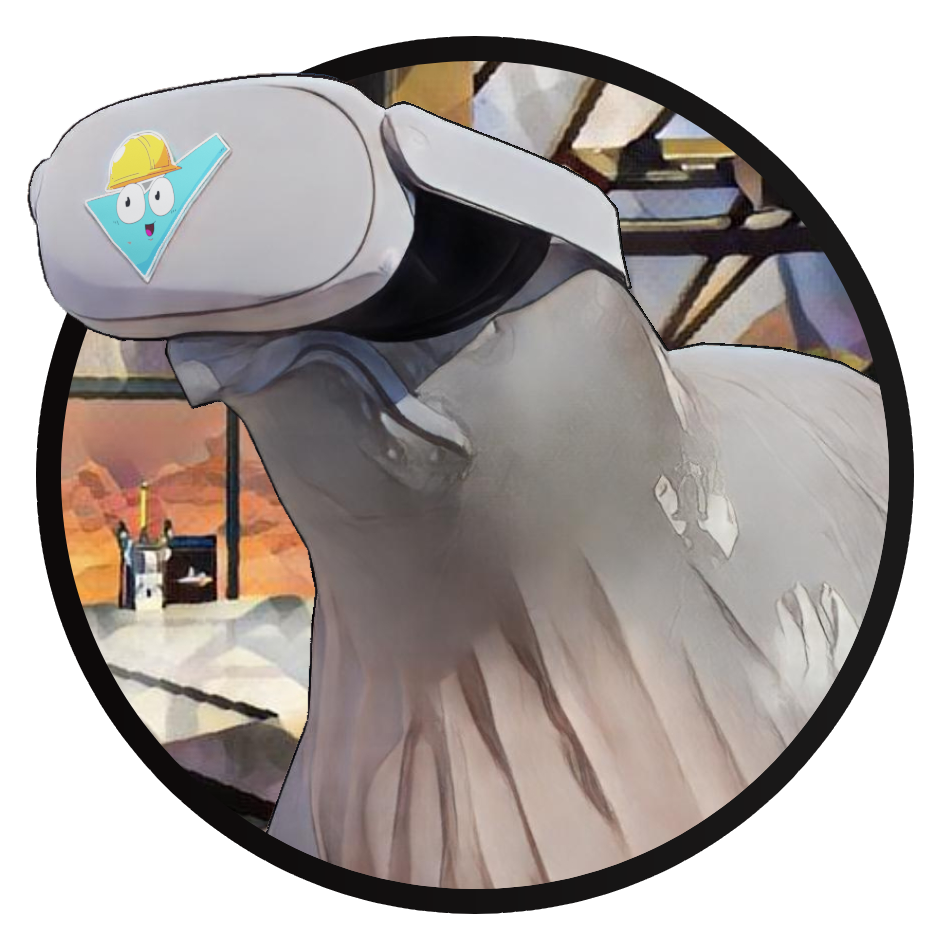

# Satisfactory UEVR Enhancements

This is a [mod for Satisfactory](https://ficsit.app/mod/UEVREnhancements) intended to accompany Praydog's [Unreal Engine Virtual Reality (UEVR) Tool](https://uevr.io/), to provide VR-specific UI and interaction enhancements, to make playing Satisfactory in VR more practical and enjoyable.

**This mod does not enable VR! It adds VR controls and interactions.** You will also need:
- Version [1.05 or newer](https://github.com/praydog/UEVR/releases) of the UEVR Tool
- The Satisfactory profile for UEVR depending on where you bought Satisfactory:
	- [UEVR Profile for Steam Satisfactory](https://github.com/dortamur/satisfactory-uevr-enhancements/raw/master/UEVR/FactoryGameSteam-Win64-Shipping.zip)
	- [UEVR Profile for Epic Store Satisfactory](https://github.com/dortamur/satisfactory-uevr-enhancements/raw/master/UEVR/FactoryGameEGS-Win64-Shipping.zip).

See the [Getting Started](https://github.com/dortamur/satisfactory-uevr-enhancements/wiki/Getting-Started) page for full installation details, and the [Troubleshooting](https://github.com/dortamur/satisfactory-uevr-enhancements/wiki/Troubleshooting) page if you have problems getting it working.
See the [Controls](https://github.com/dortamur/satisfactory-uevr-enhancements/wiki/Controls) for tips on usage, and check the [Roadmap](https://github.com/dortamur/satisfactory-uevr-enhancements/wiki/Roadmap) for current progress and future goals.

For further information, see:

- [Getting Started](https://github.com/dortamur/satisfactory-uevr-enhancements/wiki/Getting-Started)
  - [First Time Installation and Setup](https://github.com/dortamur/satisfactory-uevr-enhancements/wiki/Getting-Started#first-time-installation-and-setup)
  - [Starting Satisfactory with UEVR](https://github.com/dortamur/satisfactory-uevr-enhancements/wiki/Getting-Started#starting-satisfactory-with-uevr)
  - [Upgrading](https://github.com/dortamur/satisfactory-uevr-enhancements/wiki/Getting-Started#upgrading)
- [Controls](https://github.com/dortamur/satisfactory-uevr-enhancements/wiki/Controls)
- [Troubleshooting](https://github.com/dortamur/satisfactory-uevr-enhancements/wiki/Troubleshooting)
- [Multiplayer](https://github.com/dortamur/satisfactory-uevr-enhancements/wiki/Multiplayer)
- [Roadmap](https://github.com/dortamur/satisfactory-uevr-enhancements/wiki/Roadmap)

Check out the [Video Guide](https://www.youtube.com/watch?v=5PAEs0eoGuk), or [pop by my twitch channel](https://www.twitch.tv/dortamur) to see the mod in action!

## Support this project

If you enjoy this mod or my other content, please consider donating to my [completely optional tip jar](https://ko-fi.com/dortamur).

If you're interested in purchasing a Quest VR headset, using my [referral link](https://www.meta.com/referrals/link/Dortamur) supports me and gives you store credit!

If you'd like to help out with development, the mod source is available on [github](https://github.com/dortamur/satisfactory-uevr-enhancements).
If you'd like to help with testing updates before they are released, join the [#sf-join](https://discord.com/channels/747967102895390741/1247534737585864745) channel on the  [Flat2VR Community](https://flat2vr.com/).

You can contact me on Discord on the [Satisfactory Modding server](https://discord.gg/xkVJ73E) or [Flat2VR Community](https://flat2vr.com/), or catch me [live on twitch](https://www.twitch.tv/dortamur)!

## Credits

- Almine for sharing UE5 and Satisfactory mod techniques and code, and working on his own [Satisfactory VR prototype](https://github.com/Almine2/SatisfactoryVRPlugins)
- Rafi for providing [custom icons](https://github.com/rccrossde/Satisfactory_VRicons) and other UI design help
- Calcipher for his modelling help for the new logo
- [Praydog](https://github.com/praydog) and his awesome [UEVR Tool](https://uevr.io/)
- [Satisfactory Modding Community](https://discord.gg/xkVJ73E) for their help, and the [Modding Documentation](https://docs.ficsit.app/satisfactory-modding/)
- [Flat2VR Community](https://flat2vr.com/) for their enthusiastic support and feedback.
- [Coffee Stain Studios](https://www.coffeestainstudios.com/) for making such an awesome game
- [Oculus Controller Icons](https://www.figma.com/community/file/1277443078935776593) by Felix Z
